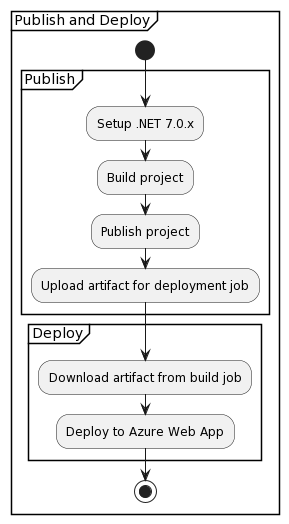

# Design and Architecture of _Chirp!_

## Domain model
The following entity-relation-diagram illustrates _Chirp!_'s domain model.


Each Cheep stores its id, some text, a timestamp that denotes when it was posted, and its author's id.

Each Author (AspNetUser) stores their id, username, email, password hash, whether they have two-factor-authentication enables, aswell the above mentioned. Author's can also follow each other in a many-to-many relation.

The AspNetUser, AspNetUserTokens, and AspNetUserLogins comes from ASP.NET Core Identity that _Chirp!_ uses to manage its users (i.e. Authors). In reality, each AspNetUser also stores additional attributes that are not used directly by _Chirp!_. These are normalized username and email, concurrency and security stamps (used for e.g. password-resetting), phone number (_Chirp!_ doesn't collect phone numbers), lockout information, and an access failure count.
The AspNetUserTokens stores tokens such as two-factor-authentication keys and recovery codes, and AspNetUserLogins stores third-party login provider information, e.g. Github OAuth.

\pagebreak

## Architecture — In the small
The following diagram illustrates _Chirp!_ overall architecture.


Each layer only depends on the layer it encapsulates, i.e. Chirp.Infrastructure depends on Chirp.Core but not Chirp.Web.

The layer Chirp.Core contains interfaces, in yellow, and DTOs, in red. The interfaces describe the communication between the database and the application. The DTOs (data transfer models) are objects that are used to send data between the layers and consists of a common set data that is used by both Chirp.Web and Chirp.Infrastructure.

The layer Chirp.Infrastructure implements the interfaces from Chirp.Core. _Chirp!_ uses Entity Framework Core to manage writing the queries for the database, which helps keep Chirp.Infrastructure database agnostic. It also describes how the database should be modeled.

The layer Chirp.Web handles connecting to the database, reacts to requests, and displays the web pages. Chirp.Web uses Chirp.Infrastructure through the interfaces and DTOs from Chirp.Core. _Chirp!_ uses ASP.NET Core Razor Pages to help create the web application.

\pagebreak

## Architecture of deployed application
The following diagram shows the architecture of the deployed application.


_Chirp!_ is a client-server application. _Chirp!_ is deployed to Azure as a web app, which is also connected to an Azure database.

\pagebreak

## User activities
The following diagrams illustrates how a user might navigate around and use _Chirp!_.

### Register and Cheep


Here a new user visits _Chirp!_ for the first time and wants to register as an author. The diagram shows which pages and actions the user needs to navigate through to achieve this.

\pagebreak

### Follow and Unfollow


Here an already logged in user visits _Chirp!_ to follow and unfollow another author. The diagram shows how a user might follow an author and see how their followed timeline and about me page changes.

\pagebreak

### Personal Data and Deletion


Here an already logged in user visits _Chirp!_ to check what data the _Chirp!_ stores of them, and wants to delete their account. The diagrams shows how the about me page leads to the manage account page where personal data is shown. From there, it is also possible to delete your account.

\pagebreak

## Sequence of functionality/calls trough _Chirp!_
The diagram below shows the first sequence diagram.


This sequence diagram shows the network traffic of a user requesting the homepage of our Chirp application as well as which database queries are made.

\pagebreak


This sequence diagram shows the network traffic of an already logged in user requesting the about me page.

\pagebreak


This sequence diagram shows the network traffic of a not logged in user attempting to register with GitHub. (The stylesheet and favicon requests have been omitted.) We don't know much about the requests sent between GitHub as well as the database in this case, because it is handled by ASP.NET Core Identity, and is not written by us.

\pagebreak

# Process

## Build, test, release, and deployment
We use GitHub Actions to manage releasing, deployment, and testing automatically with workflows. All our workflows runs on Ubuntu Linux. Each of the following Activity diagrams illustrates the flow of our workflows.

### Build and Test


This workflow runs automatically on every push on any branch, and it simply builds and tests the project. This is useful because it can give some baseline information on the status of a commit, and it makes it easier to catch errors early. It helps check if a branch/pull requests can be merged into the main branch. It uses the Checkout Action to retrieve the commit that triggered this workflow, and the Setup-dotnet Action that prepares a .NET CLI environment, which in our case uses any 7.0.x version of .NET.

\pagebreak

### Publish and Deploy


This workflow runs automatically on every push to the main branch. It builds the project and deploys it to our Azure Web Service. This workflow is split into two jobs: publish and deploy. The publish job similarly to the Build and Test workflow except it doesn't test, but instead runs the `dotnet publish` with the Chirp.Web project that produces the files, that is sent to the Web Service. The files are uploaded via the Artifact Action, which allows them the be downloaded again later so that they are available for the deploy job. The deploy job uses the Azure Webapps Deploy Action to deploy the application. A benefit of splitting the workflow into multiple jobs is that if any of the jobs fails, you don't need to rerun _all_ the previous jobs.

\pagebreak

### Publish and Release


This workflow runs automatically on every push with a tag that has the pattern: "vX.X.X". It first builds and tests the project, to make sure we don't unintentionally release a version that fails our tests. It uses `dotnet publish` like the Publish and Deploy workflow, except it publishes the project for each of the operating systems: Windows, Linux, and MacOS on x64 architectures using a simple bash script that also zips the files into files with names like the following: `Chirp-<tag>-<os>-x64.zip`. The Files as well as the source code is then added to a new _Chirp!_ release on GitHub with the chosen tag as the version number.

\pagebreak

## Team work
The following image shows the project board right before hand in.


The issues we did not get to, were caused by some issues with not being able to run docker for all group members, and Playwright not working. We did also not have the time to implement reactions.

\pagebreak

The flow of activities in our group is illustrated below.


After lectures, group members made issues from the tasks in the readme files from the lecture notes. These issues were then implemented in branches, and merged into main with pull requests. Pull requests require other group members to accept them.

\pagebreak

## How to make _Chirp!_ work locally
Requirements to run _Chirp!_ locally:
* .NET 7.0.x SDK
* .NETCore 7.0.x Runtime
* AspNetCore 7.0.x Runtime

### Download and run
1) Download the latest release from the [releases page](https://github.com/ITU-BDSA23-GROUP13/Chirp/releases).
2) Extract the zip file.
3) Open a terminal in the extracted folder.
4) Run executable.

### Building from source
1) Clone the repository
```bash
git clone https://github.com/ITU-BDSA23-GROUP13/Chirp.git
```
2) Change directory to the repository
```bash
cd Chirp
```
3) Run the project
```bash
dotnet run --project src/Chirp.Web
```

### Additional functionality
Without further configuration, _Chirp!_ will use a Sqlite database stored in a temporary folder. To use a Sql Server database, you must locate the src/Chirp.Web/appsettings.Development.json file with you chosen editor and change the connection string next to AZURE_SQL_CONNECTIONSTRING with a valid connection string. Using GitHub as a third-party OAuth login provider will also be disabled, but can be enabled by setting the CHIRP_GITHUB_CLIENT_ID and CHIRP_GITHUB_CLIENT_SECRET environment variables.

## How to run test suite locally
Assuming you have done the steps from above, you simply have to run the following command in the root of the repository:
```bash
dotnet test
```

This will run all of the test using in-memory Sqlite databases.

\pagebreak

# Ethics

## License
_Chirp!_ uses the MIT license. This license was chosen because it is a very permissive license, which we don't mind as _Chirp!_ was only developed for educational purposes. It is also very short and simple to understand.

## LLMs, ChatGPT, CoPilot, and others
ChatGPT and GitHub Copilot has been used the authors of _Chirp!_.

The use of ChatGPT has been _very_ minimal, and no code was directly copied from ChatGPT. It has been used by some authors to help understand some concepts or error messages. It has also been used to answer more creative questions such as what kinds of reactions would fit the theme of _Chirp!_ if we wanted to add reactions to Cheeps.

GitHub Copilot has also been used by some authors, but it has been used exclusively as a tool to write code/boilerplate _faster_. Some editors allow you to disable Copilot from automatically suggesting code, and instead use a keybinding to manually make Copilot come with a one-time suggestion. This has the benefit of making Copilot not show suggestions when it is not needed, which is the vast majority of the time we spend coding. Though, we do find Copilot to be very useful when we write boilerplate/repeating/obvious code, and in these cases Copilot can be manually enabled to generate the code. In other words, Copilot has primarialy been used to generate code that we already intended to write, and not to generate new code that we didn't understand.

